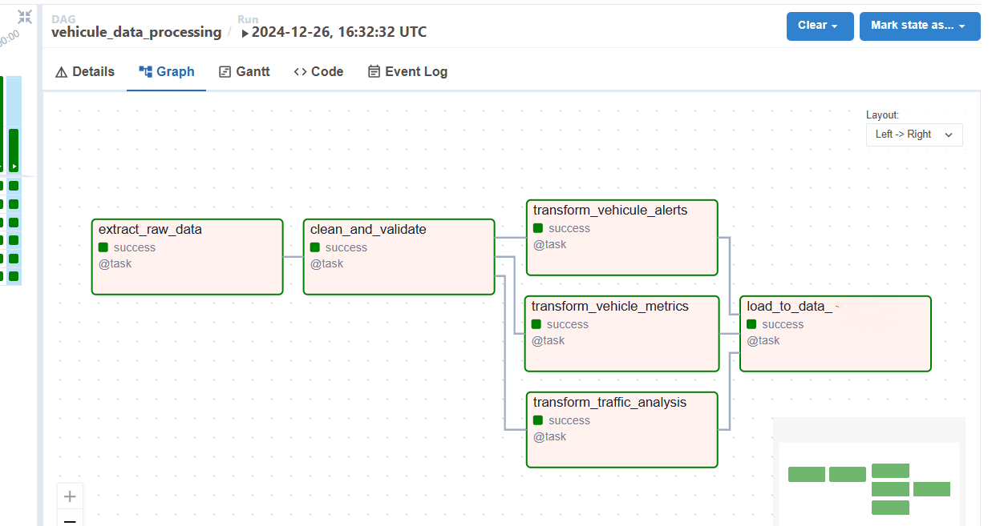

# Vehicle Data ETL Pipeline

This project focuses on building an ETL (Extract, Transform, Load) pipeline to process and analyze vehicle data. The pipeline integrates data from Kafka, processes it with Apache Spark, and stores the transformed data in Elasticsearch.  
By leveraging modern data engineering tools, the project facilitates real-time insights into vehicle metrics, traffic patterns, and alerts.  

This project handles the creation and integration of Kafka, Airflow, and ELK (Elasticsearch, Logstash, and Kibana). It manages these components, ensuring seamless communication between them. Additionally, it sets up ELK with Kibana for data visualization and analysis, allowing for efficient and detailed exploration of the data.

## Project Overview

The Vehicle Data ETL Pipeline project is designed to handle high volumes of vehicle sensor data, enabling:

- **Real-time data ingestion:** Data is collected from Kafka topics representing vehicle sensor streams.
- **Data cleaning and validation:** Raw data is cleaned, validated, and formatted for further analysis.
- **Metric calculation:** Key vehicle metrics such as average speed and trip duration are calculated.
- **Traffic analysis:** Insights into traffic patterns are derived by analyzing vehicle movements.
- **Alert processing:** Alerts from vehicles are aggregated and categorized.
- **Data storage:** The processed data is stored in Elasticsearch for querying and visualization.

## Technologies Used

- **Apache Kafka:** For real-time data streaming.
- **Apache Spark:** For data processing, transformation, and analytics.
- **Elasticsearch:** For data storage and search capabilities.
- **Docker:** To containerize the application and its dependencies.
- **Airflow:** For orchestrating the ETL workflow.
- **Python:** As the primary programming language for implementing the pipeline.

## Data Pipeline Overview

The Vehicle Data ETL Pipeline is designed to manage vehicle data from ingestion to actionable insights. Below are the main stages of the pipeline:

1. **Data Ingestion:**
   - Raw data is ingested in real-time from Kafka topics that capture sensor data from vehicles.

2. **Data Cleaning and Validation:**
   - The pipeline validates and cleans the data by removing duplicates, ensuring schema consistency, and applying quality checks like verifying speed, fuel levels, and timestamps.

3. **Data Transformation:**
   - Key metrics like average speed, trip duration, and vehicle count are calculated.
   - Alerts from vehicles are processed and aggregated by severity and type.
   - The pipeline derives insights into traffic patterns based on time, location, and vehicle activity.

5. **Data Storage:**
   - Processed data is stored in Elasticsearch, making it accessible for querying and visualization.

## Key Features of the Pipeline

- **Real-Time Processing:**
  - Enables near real-time analytics of vehicle data, making it suitable for dynamic monitoring.

- **Scalable and Modular:**
  - Handles high volumes of data and allows for the addition of new data sources or analytical features.

- **Comprehensive Metrics:**
  - Generates detailed vehicle-specific metrics and traffic insights, ensuring actionable data for stakeholders.

- **Alert Management:**
  - Captures and categorizes vehicle alerts, providing insights into operational safety and efficiency.

- **Visualization-Ready Data:**
  - Integrates seamlessly with tools like Kibana for creating dashboards and visual reports.
    

---
## Usage Scenarios

- **Fleet Management:** Monitor vehicle performance and optimize routes.
- **Traffic Monitoring:** Analyze congestion patterns and improve urban planning.
- **Alert Monitoring:** Track critical events and ensure vehicle safety.

